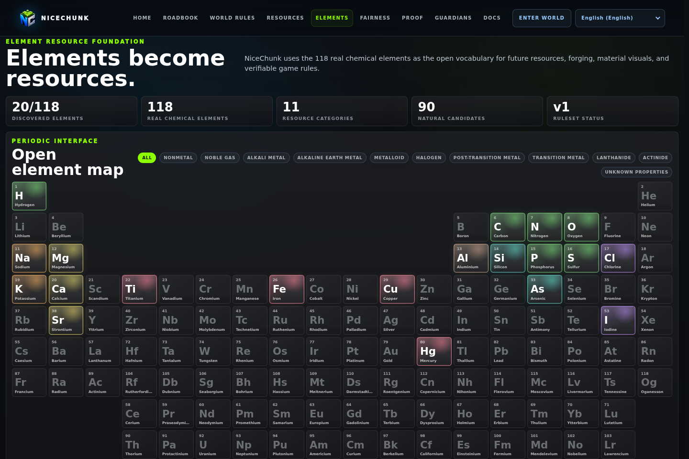
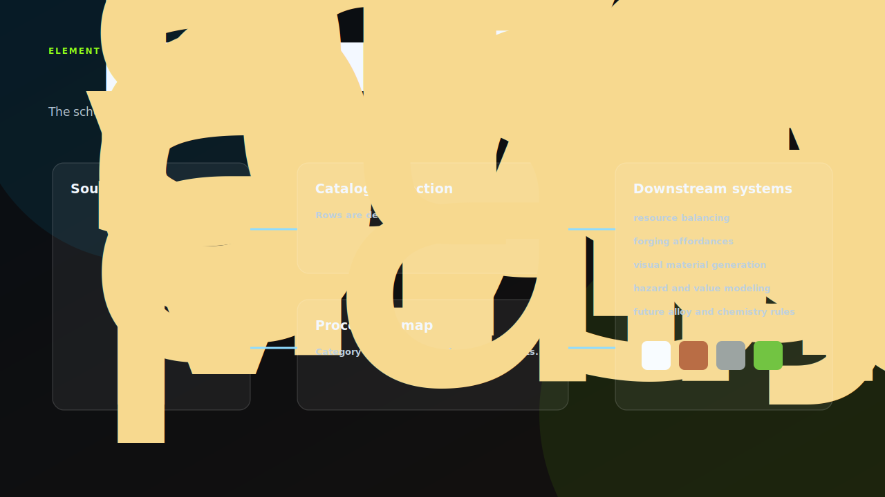

# NiceChunk Elements

Element definitions, catalog logic, and element reference page.

## Project Overview

This repository contains the element system used by NiceChunk. It includes raw element definitions, catalog transformation logic, and the browser page that presents elements as a structured reference.

Elements are a design layer that can influence materials, resource interpretation, forging behavior, and future item metadata.

Separating this repository makes it easier to evolve element taxonomy without mixing it into gameplay rendering or chain program code.

## Schema Pipeline

The element model is deliberately richer than a periodic table widget. Each record carries identity, atomic values, physical measurements, chemical behavior, gameplay weights, processing constraints, affinity scores, and visual genes. The page-facing catalog is derived from that record rather than maintained as separate display data.

That gives the repository a useful review surface. A change to an element can be evaluated as data: does it alter mining difficulty, processing risk, visual material behavior, future alloy potential, or only presentation? The answer should be visible in the record structure.

The category processing map is not final crafting design. It is a bridge between raw element taxonomy and system-level behavior such as forge tier, heat band, containment, and station type.

## System Principles

- Definitions should be canonical: element data belongs in a structured source module that other systems can import.
- Catalog presentation should be derived: display labels and categories should come from definition data and i18n keys.
- Element metadata should support future rendering and crafting systems without forcing early coupling.
- The page should remain a developer and designer reference, not a marketing-only surface.

## How It Works

- Update element definitions in the data module.
- Use the catalog helper to derive page-ready categories and labels.
- Inspect the elements page to confirm categories, descriptions, and block atlas relationships.
- Coordinate changes with forging and resource rule repositories when element semantics change.

## Why This Project Matters

A voxel world benefits from a consistent material vocabulary. Elements provide that vocabulary for resources, forging, visual traits, and future metadata systems.

A separate element repository gives contributors a safe place to discuss taxonomy and data structure without touching core gameplay code.

## Repository Layout

- `elements/`
- `src/data/elements.js`
- `src/elementsCatalog.js`

## Development Workflow

1. Clone the repository and inspect the focused source tree before changing shared contracts or generated artifacts.
2. Keep changes scoped to the domain of this repository. Cross-domain changes should be coordinated through the matching split repositories.
3. Run the smallest meaningful validation for the touched surface: build checks for programs, browser checks for pages, or fixture checks for deterministic libraries.
4. Update screenshots and documentation when behavior, visible UI, public constants, or developer-facing workflows change.

## Future Development Direction

- Add schema validation for element definitions.
- Define stable element IDs for future on-chain or asset metadata use.
- Connect element traits to material rendering experiments.
- Expose generated JSON artifacts for downstream tools.

## Maintenance Notes

This repository is a focused split from the main NiceChunk working tree. Keep the public surface explicit: avoid committing private keys, wallet files, deployment-only scripts, machine-specific configuration, or generated build artifacts. Runtime user-facing copy should stay behind the i18n layer where the project has an i18n surface.
